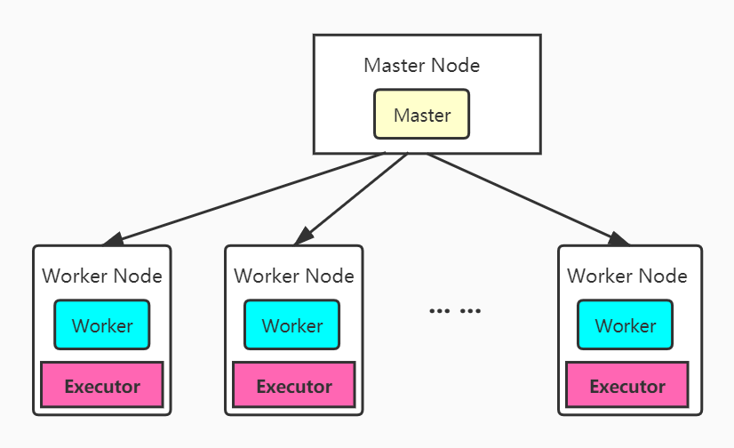
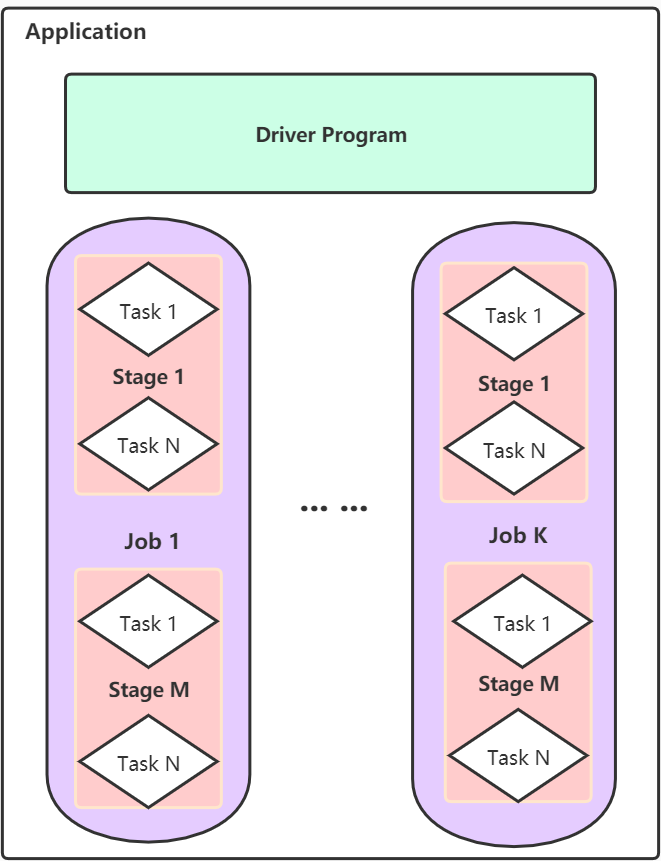
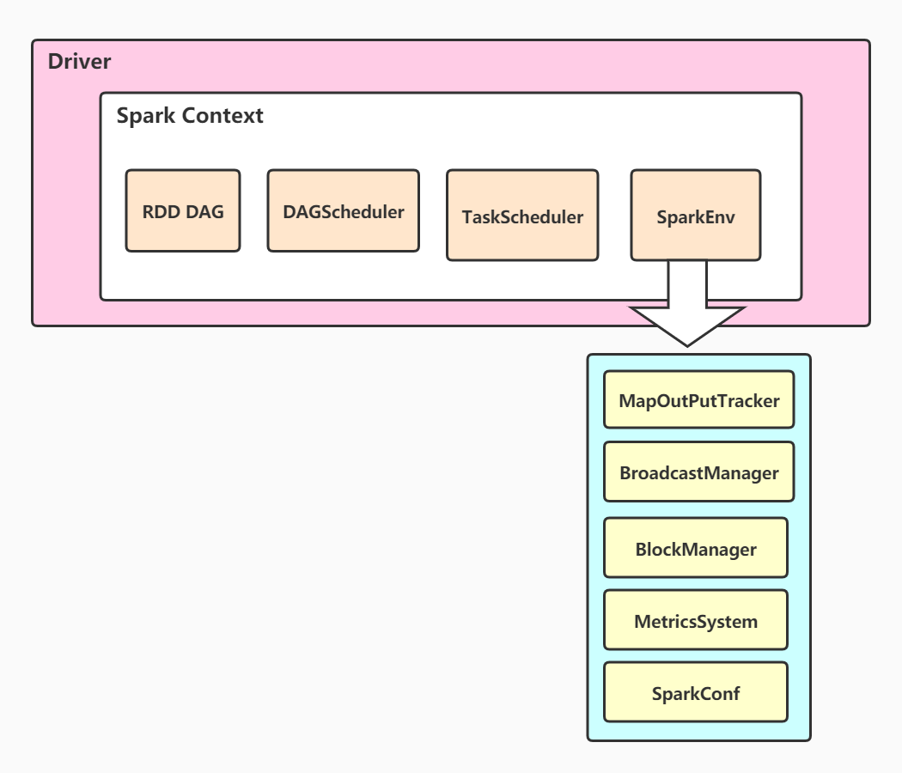
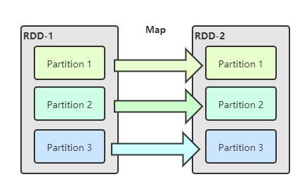
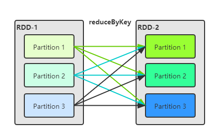
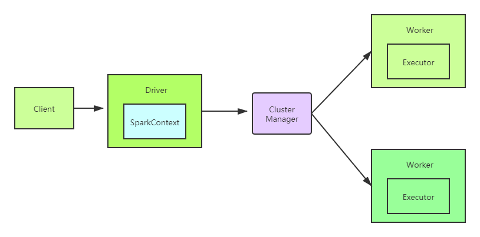
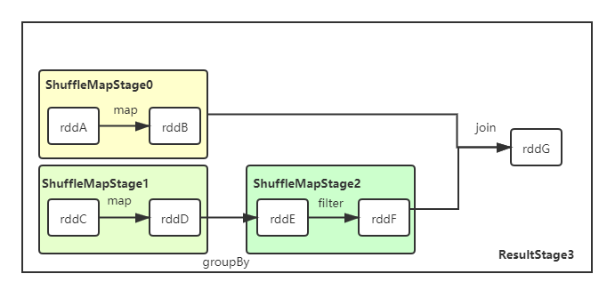

# 第2节 Spark Core讨论

## 第2.1节 Spark 架构



上图展示了Spark的架构的简单示意。

我们不妨先这样认识Spark，它有几个重要的部分：

- Master Node：它是集群部署时候的概念，是整个集群的控制器，负责集群的正常运行，管理Worker Node。
- Worker Node：它是计算节点，会接收Master Node的命令，并进行状态汇报。
- Executors：每个Worker Node上都有一个Executor，它负责完成任务的执行，是一个线程池。
- Spark集群部署后，需要在主从节点启动Master进程和Worker进程。运行Master进程的节点是Master Node，运行Worker进程的节点是Worker Node。

这就是一个简要版的Spark架构解释，让我们明白了Spark集群中最重要的几个组成部分，有了这些部门，我们就可以深入探讨Spark的其他内容。

还记得我们在MapReduce中，用户每次提交的都是一个作业。但是在Spark中却不是。Spark对于Job另有一番定义，我们在Spark基础中有过描述，在Spark，用户编写提交的代码称为一个应用（Application）。详细来说：

- Application：基于Spark的应用程序，包含一个Driver程序和多个Executor，当然，我们知道，这个Executor位于Worker中。下图给出了Application的内部图。



这个图让我们十分轻松地理解了Spark中的若干个重要的概念。

- Driver：应用程序的执行起点，负责作业调度，它会执行Application中的main函数。
- Task：Spark中的基本执行单元，它在一个Executor中执行，对应Spark中的分区（partition）。
- Stage：一个作业的世系图按照宽依赖进行划分，分出的就是一个Stage，它也被称为 Task Set，一个Stage内部会包含若干个task。
- Job：由Spark中的行动操作触发。

此时，我们再回味这几个概念，是不是更清楚了？当然，你也可以去前一节看看这几个概念我们是怎么引出来的。我们需要注意的是， **一个Worker上只能有一个Executor，Worker和Executor之间是一一对应的关系** 。

这样看来，我们也不难得出结论，Spark也是 **Master/Slaver架构** 。

## 第2.2节 Spark 执行原理

### 一、先学会WordCount

我们依然把WordCount当作我们的基本用例，虽然前文已经给了WordCount代码，但是我们想试着写一下。还记得之前MapReduce的WordCount代码吗？明明简单的WordCount结果由于僵化的两阶段编程，导致代码又臭又长，反观Spark，言简意赅，极具美感。

第一次写，一定会懵，但是无所谓，我们先思考再动手。

- 我们需要写一个Spark的代码，我们前文说过，Driver进程是Application执行起点，它会执行Application的main函数。所以我们知道（当然，我扯了这么多，就算我不扯你也应该知道，代码是从main函数开始执行的）整个代码应该都是再main函数中书写的。
- 我们写Spark代码，需要写创建好Spark的执行环境，包括告诉计算机：Application的名字；启动几个节点。我们基于scala写代码，创建环境需要调用Spark中的 **SparkConf** 和 **SparkContext** 。（local模式是指代码在本地运行而非远程执行）。scala中，定义变量用 **var** ，定义常量用 **val** 。我们创建好Spark的上下文环境，就不要改变了，所以这里都用了 **val** 。其实，如果你还记得我们前文描述的 RDD，你就应该清楚，RDD是不可变的，如果需要修改，就只能创建新的 RDD。所以，其实我们下文都是用 **val** 定义不可变的常量。

```scala
val conf = new SparkConf() //初始话SparkConf类
			.setMaster("local[*]") //告诉集群，我们启用的是local模式，*表示启用尽可能多的节点，你可以把*改成具体数字
			.setAppName("WordCount") //应用名字为 WordCount
val sc = new SparkContext(conf) //创建Spark的执行环境
```

- 之后就是常规操作了，就是调用算子进行计算。我们这样思考，一开始我们仅仅是文本，Spark中没有Hadoop中的InputFormat将输入数据自动转化为键值对，因此就需要我们自己处理。我们的想法也很粗暴简单：

  - 文本拆分，将

  ```
  Hello, What's your name ? =>(拆分) 
  		(Hello,) + (what's) + (your) + (name) + (?)
  ```

  - 拆分完成后，将每个word组成键值对

  ```
  (Hello,) => (Hello, , 1)
  (what's) => (what's , 1)
  (your)  => (your , 1)
  (name) => (name , 1)
  (?) => (? , 1)
  ```

  - 之后，按照key指相加，就得到最后结果了。

  ```scala
  // 调用textFile算子读取文件数据
  val wordpair = sc.textFile("D:\\代码\\java\\Apache-Spark\\data.txt")
  val results = wordpair.flatMap(_.split(" ")) // 按空格对文本做拆分
  					.map((_,1)) // 组成键值对
  					.reduceByKey(_+_) // 按照key值相加
  ```

这样，一个WordCount就写完了。我们只需要将结果打印出来就可以了。

```scala
import org.apache.spark.{SparkConf, SparkContext}

object WordCount {

  def main(args: Array[String]): Unit = {
    val conf = new SparkConf().setMaster("local[*]").setAppName("WordCount") 
    val sc = new SparkContext(conf)
    val wordpair = sc.textFile("D:\\代码\\java\\Apache-Spark\\data.txt") 
    val results = wordpair.flatMap(_.split(" ")).map((_,1)).reduceByKey(_+_)

    results.foreach(println) //打印
  }
}
```

### 二、Spark创建环境

Spark执行环境的创建是Spark代码执行的第一步，Driver会执行Application的main函数，创建SparkContext，即Spark的执行环境。我们先看一下Driver的组成。



虽然我们说SparkContext就是Spark执行的环境，但是具体来看，内部又复杂了很多。

- RDD DAG：我们知道，Spark是基于RDD抽象进行描述的，RDD执行的流程会构成世系图，世系图其实就是一个有向无环图（DAG）。SparkContext中保有RDD DAG的信息。
- DAG Scheduler：DAG调度器，显然，输入就是DAG了，它会根据DAG中RDD的依赖关系，得到Stage，将Stage提交给Task Scheduler。
- Task Scheduler：接入Stage，拆分其中的Task提交给Executor执行。
- SparkEnv：线程级别的运行环境，存储运行时的重要组件的引用：
  - MapOutPutTracker：我们知道，Spark中会有Shuffle操作的，该组件就存储Shuffle的元信息。
  - BroadcastManager：控制广播变量，并存储其元信息。
  - BlockManager：存储管理，创建和查找块。
  - MetricsSystem：监控运行时性能指标信息。
  - SparkConf：存储配置信息

那现在我们知道，Spark所谓的创建环境其实就为后续的执行做准备，将需要用到的信息要么事先创建，要么为后续使用做好准备。为了方便理解，我们给出几个上述提到的信息一些解释。

**宽窄依赖 ------  窄依赖**

- 这样考虑，一个RDD中的一个Partition中的数据仅仅对应其子RDD的一个Partition，比如说Map算子。



**宽窄依赖 ------  宽依赖**

- 一个RDD的一个Partition中的数据会被分发到其子RDD的多个Partition中。比如reduceByKey算子。一个Partition中可能会含有多种key值对应的键值对，这就造成这些key值对应的结果会被分发到子RDD的多个Partition中。



**那么，为什么会出现这种状况呢？为什么不是初始的时候，所有相同key值的数据就在同一个分区呢？很容易想到，这个和Spark的数据分区策略有关。**

- Spark中默认提供两种划分器： **哈希分区划分器（HashPartitioner）和范围分区划分器（RangePartitioner）** 。且，Partitioner只存在于 <Key, Value> 类型的RDD中，对于非键值对类型的RDD，其Partitioner值为None。
- 在创建RDD时，若我们不指定分区数，Spark提供了一些分区规则

> 如果配置文件spark-default.conf中没有显示的配置，则按照如下规则取值：
>
> 本地模式（不会启动executor，由SparkSubmit进程生成指定数量的线程数来并发）：
>
>   spark-shell                                      spark.default.parallelism = 1
>
>   spark-shell --master local[N]       spark.default.parallelism = N （使用N个核）
>
>   spark-shell --master local             spark.default.parallelism = 1
>
> 
>
>  伪集群模式（x为本机上启动的executor数，y为每个executor使用的core数，z为每个 executor使用的内存）
>
>    spark-shell --master local-cluster[x,y,z]            spark.default.parallelism = x * y

所以，初始的时候，我们输入的所有数据，它的Partitioner值是None，因此，他们一般是按照大小来进行分区的，这个时候就可以理解为什么会出现宽窄依赖这种状况了。

**广播变量** 是一项重要技术，我们在后面的内容介绍。

### 三、Spark集群的启动

有了前面的介绍，我们就可以进一步介绍Spark程序的执行流程了。

首先，我们需要启动集群。Spark的启动主要是Master节点和Worker节点之间的通信。

- Master节点先启动，随之会启动Worker节点，每个Worker节点启动时需要向Master节点发送注册信息
- Master节点收到消息后需要对Worker节点发送的信息进行验证、记录。若是Worker节点注册成功，Master节点会将注册成功的消息发送回Worker
- Worker节点收到注册成功的信息后就会定期发送心跳（Heartbeat）给Master

### 四、Spark任务执行



- 首先，客户端（Client）会向集群提交一个应用（Application），Master会启动Driver程序；
- Driver会向Cluster Manager申请资源，构建Application的运行环境，即启动SparkContext；
- SparkContext会向Cluster Manager申请Executor资源，Executor则向SparkContext申请Task，SparkContext会将代码下发到Executor。需要注意的是，Standalone模式下，Cluster Manger由Master充当；在Yarn模式下，Cluster Manager由Resource Manager充当；

这里讲述的其实就是上图展示的一个Spark应用执行的大体流程。但是Spark应用执行中，会涉及到 **Application | Job | Stage | Task** 这些概念的转换，由此我们可以进行更细致的讨论。

-  我们知道，Spark提交一个应用，应用的代码由一系列RDD操作构成。每次遇到行动操作则触发作业（Job）执行，Spark依据RDD之间依赖关系构建DAG图，DAG图构建好之后提交给DAGScheduler进行解析；

- DAGScheduler会把DAG进行拆分，变成相互依赖的调度阶段（Stage），拆分依据则是RDD之间的依赖是否会宽依赖。在Spark执行的时候，调度阶段的拆分按照如下步骤进行，我们以下图为例：

  

  - Job在SparkContext中提交运行的时候会调用DAGScheduler中的handleJobSubmitted进行处理，该方法会先找到最后一个RDD，也就是rddG，然后调用getParentStages方法；
  - 在getParentStages方法中，会判断RDD之间是否存在Shuffle操作（即，宽依赖），在此例中，Join操作是Shuffle操作
  - 调用getAncestorShuffleDependenices方法从rddB向前遍历，发现该依赖分治上没有其他宽依赖，故调用newOrUsedShuffleStage 方法生成调度阶段（Stage）ShuffleMapStage0；
  - 使用getAncestorShuffleDependenices方法从rddF向前遍历，发现存在宽依赖 groupBy ，以此分界划分 rddD 和 rddC 为ShuffleMapStage1，rddE 和 rddF 为ShuffleMapStage2；
  - 最后得到生成rddG的ResultStage3
  
- 我们知道Stage又称task set，因此每一个调度阶段内会包含多个任务，Spark会将Stage提交给TaskScheduler进行调度，同时DAGScheduler会记录哪些RDD被存入磁盘，监控哪些调度阶段调度失败等；

- TaskScheduler会接收来自DAGScheduler发送的task set，然后将task set中的任务一个个发送到Worker节点上的Executor上进行执行。如果task执行失败，TaskScheduler需要负责重试；

- Worker中的Executor接收到TaskScheduler发送过来的任务后会以多线程的方式运行，任务结束后将结果返回给TaskScheduler。

### 五、Spark中的容错

在前面的讨论中，我们知道了Spark系统中一些基本要素：Master、Worker、Executor。这些要素其实就是一些物理节点或者是线程、进程，既然如此，他们就必然可能会出错。这也是大数据领域的基本思想：出错被认为是常态。那出错之后，Spark该如何应对呢？

1. Executor异常

   - Executor启动过程：集群中的master节点给应用分配运行所需要的资源之后，Worker节点会启动ExecutorRunner，ExecutorRunner会根据当前运行模式启动GoarseGrainedExecutorBackend进程，他会向Driver发送注册Executor信息。如果注册成功，GoarseGrainedExecutorBackend会在内部启动Executor。Executor由ExecutorRunner进行管理，当Executor出现异常时，由ExecutorRunner捕获该异常，并发送ExecutorStateChanged消息给Worker。
   - Worker接收到异常信息后，在Worker上的HandlerExecutorStateChanged方法会依据Executor的状态进行信息更新，同时将Executor信息发送给Master。
   - Master接收到Executor状态变化后，如果发现Executor异常退出，则调用Master.schedule方法，尝试获取可用的Worker节点并启动Executor。而这个Worker节点很可能不是之前的Worker节点。系统会尝试10次，如果超过10次，则标记该应用程序失败，并从集群中移除。这种设定是为了避免反复提交有Bug的程序，占用系统资源。

2. Worker异常

   - Spark集群中采用Master/Slaver模式。Worker扮演从节点，会定时给Master发送心跳信息，让Master知道Worker的实时信息。不仅如此，Master还会感知注册的Worker节点是否出现超时。
   - 为了感知Worker是否超时未发送心跳信息。在Master接收到Worker心跳的同时，在其启动方法onStart中启动Worker超时检测线程。
   - 当Worker出现异常时，会依据自身运行的是Executor还是Driver进行处理：
     - 如果运行的是Executor，Master会先把Worker上运行的Executor信息发送消息ExecutorUpdated给对应的Driver，告知Executor已丢失，同时把Executor从运行的应用程序列表中删除。之后在进行Executor异常的处理流程。
     - 如果运行的是Driver，则判断是否设置了重新启动。如果需要，则调用Master.schedule方法进行调度，分配合适节点重启Driver。否则就删除该应用。

3. Master异常

   - Master异常牵涉到Spark的HA机制。

- 在集群启动的时候，Master会启动一个或者多个standby Master，当Master出现异常的时候，standby会依据规则确定一个接管Master。有如下几种模式，默认是None。
  - Zookeeper：元数据持久化到Zookeeper中。
  - FileSystem：集群元数据持久化到本地文件系统中。
  - Custom：自定义恢复方式。
  - None：不持久化集群元数据。当Master出现异常时，新启动的Master不进行恢复集群状态，直接接管。

## 第2.3节 Spark的执行原理

Spark是基于内存进行计算，但是Spark中RDD所表示数据集不仅可以存储在内存中，也可以存储在磁盘中。Spark中提供了两种显示的缓存控制方法： **cache** 和 **persist ** 。

```scala
val data = sc.textFile("path")
val dataFirstSolve = data.flatMap(_.split(" ")).map((_,1))
dataFirstSolve.cache() // 对处理好数据进行缓存，cache仅支持缓存在内存中
dataFirstSolve.persist()
```

**persist** 算子支持多种不同的存储级别。

```scala
DISK_ONLY  //仅磁盘
DISK_ONLY_2  // 仅磁盘，有2份
MEMORY_ONLY // 仅内存，以下同
MEMORY_ONLY_2
MEMORY_ONLY_SER // 仅内存，并且对数据做了序列化
MEMORY_ONLY_SER_2
MEMORY_AND_DISK
MEMORY_AND_DISK_2
MEMORY_AND_DISK_SER
MEMORY_AND_DISK_SER_2
```

默认情况下，性能最高的当然是MEMORY_ONLY，但前提是你的内存必须足够足够大。如果纯内存的级别都无法使用，那么建议使用MEMORY_AND_DISK_SER策略，而不是MEMORY_AND_DISK策略。因为既然到了这一步，就说明RDD的数据量很大，内存无法完全放下。序列化后的数据比较少，可以节省内存和磁盘的空间开销。同时该策略会优先尽量尝试将数据缓存在内存中，内存缓存不下才会写入磁盘。通常不建议使用DISK_ONLY和后缀为2的级别：因为完全基于磁盘文件进行数据的读写，会导致性能急剧降低，有时还不如重新计算一次所有RDD。后缀为2的级别，必须将所有数据都复制一份副本，并发送到其他节点上，数据复制以及网络传输会导致较大的性能开销，除非是要求作业的高可用性，否则不建议使用。

Spark采用了惰性计算的方式，每次需要该RDD的数据的时候，都会重新计算，这是一种耗时的方式， **cache** 和 **persisit** 两个算子可以将已经计算出的数据缓存起来，可以方便下次直接使用。

在Spark中，除了这两种算子，还有 **checkpoint** ，它是一种设置检查点的方式。**cache** 和 **persisit** 会将数据保存在内存或者磁盘上，本质上，这些数据还是保存在计算所在的机器上，当机器故障出错，数据依然会丢失。 **checkpoint** 则可以将数据保存在一个高可用的地方，比如HDFS。并且， **checkpoint** 会切断世系图的联系，这一点很重要。

```scala
val rdd = sc.textFile("path")
sc.setCheckpointDir("path for checkpoint") // checkpoint前要先
rdd.cache() // checkpoint前由行动操作会触犯一遍计算，进行checkpoint时，会重新计算前面的世系图路径，然后切断该RDD的世系图联系，因此会计算两边，所以最好先cache
rdd.checkpoint  // checkpoint是>>>转换操作<<<
```


### 一、Spark中的Shuffle

